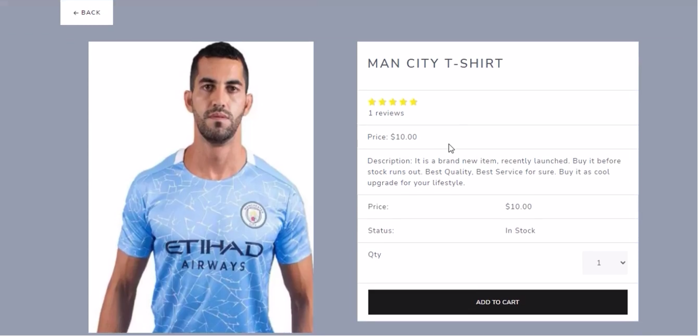
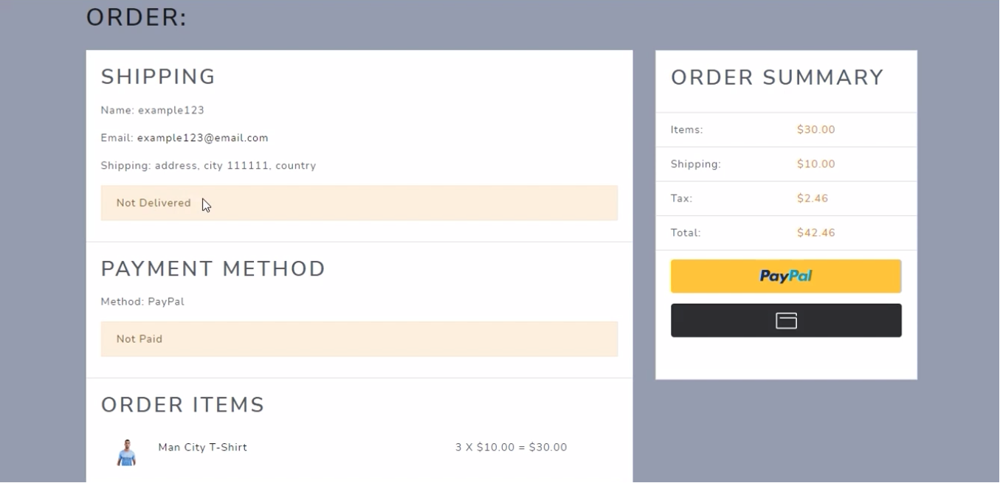
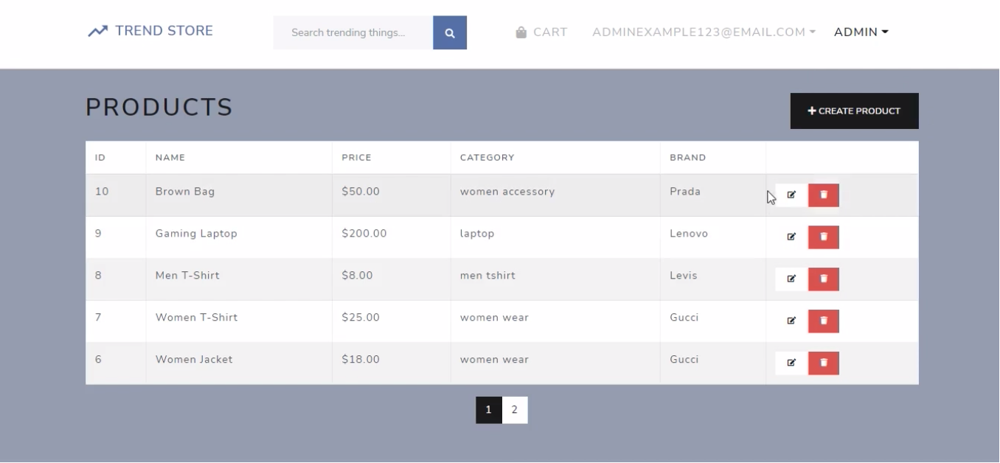

# Trend Store

An e-commerce platform for latest trending products. It allows users to View product details, Add to cart, Checkout using PayPal payment, View order history, Give review and rating, and Allow option to update profile.

This application also have admin features to Edit product details, Upload images and full screen banners, Alter user roles and order status.

**Checkout live website in the description! It may take some time to load because of shared instances.**

## Tech Stack - Django

-   Django
-   PostgreSQL
-   React
	-  React Redux
	-  React-Bootstrap
-   PayPal Payments
-   AWS S3
-   Axios
-   JWT

## Getting Started

First clone the repository from Github :

    $ git clone https://github.com/amifunny/trend-store.git
    
### Backend

Activate the virtualenv for your project.

    $ virtualenv virenv
    $ virenv\Scripts\activate
    
Install project dependencies:

    $ pip install -r requirements.txt
        
Create database migrations:

    $ python manage.py makemigrations
    
Then simply apply the migrations:

    $ python manage.py migrate
    

You can now run the development server:

    $ python manage.py runserver

### Frontend

Enter into frontend folder `client/`

    $ cd client
    
Install npm dependencies -

    $ npm install

Run development server using -

    $ npm start

### Production Server

Build static files of React frontend -

    $ cd client
    
    $ npm run build

Use gunicorn to run backend server and serve static build files -

    $ gunicorn backend.wsgi

## Screenshots

